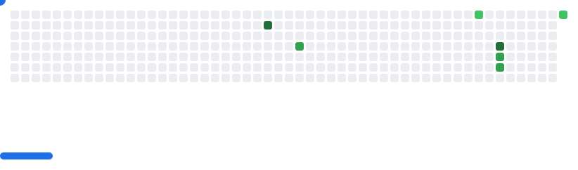

<div align="center">

# 👋 Hi, I'm Mirastar

### AI 应用开发 · RAG · Agent Workflow

[](https://github.com/Millastar)
[](mailto:Mirastar@qq.com)
[](https://mirastar.top)
[](https://www.luogu.com.cn/user/88405)


</div>

<table>
<tr>
<td width="54%" valign="top">

## 关于我 / About Me

我是一名专注于 **AI 应用工程化** 的开发者，关注 **RAG、智能 Agent、模型服务与可靠的产品体验**。我喜欢把大模型能力放进真实业务流程：让知识可检索、让 Agent 可编排、让结果可追溯，也让系统能够稳定运行和持续迭代。

I build practical AI applications around retrieval, agent orchestration, model serving, and reliable user experiences. My current work turns LLM capabilities into traceable, testable, and deployable products.

- 🔭 **当前方向**：AI 应用开发、RAG 系统、Multi-Agent 工作流
- 🧠 **工程关注**：来源引用、重排序、权限隔离、Human-in-the-Loop、幂等与补偿
- 🛠️ **工作方式**：先拆解真实场景，再设计数据流和状态流，最后用测试与评测验证
- ✍️ **技术记录**：在 [Mirastar's Blog](https://mirastar.top) 分享项目实践与排错过程

</td>
<td width="46%" valign="middle">



</td>
</tr>
</table>

## 精选项目 / Featured Projects

| 项目 | 定位 | 关键技术与工程亮点 |
| :--- | :--- | :--- |
| [ProfileGraph](https://github.com/Millastar/ProfileGraph) | 智能档案查询助手 | `Python` · `Gradio` · `LangGraph` · `Qwen Plus` · `text-embedding-v4` · `NumPy`<br>会话级文档隔离、流式生成、档案归属识别、查询改写与来源追溯。 |
| [legal-rag-assistant](https://github.com/Millastar/legal-rag-assistant) | 智能法律咨询助手 | `Python` · `LlamaIndex` · `ChromaDB` · `bge-reranker-large` · `LMDeploy` · `Qwen2.5-7B` · `Streamlit`<br>中文法律条文 RAG、Cross-Encoder 重排序、相关度阈值拒答与可追溯引用。 |
| [travel-agent-orchestrator](https://github.com/Millastar/travel-agent-orchestrator) | 酒店预订 Multi-Agent 平台 | `LangGraph` · `FastAPI` · `Gradio` · `Redis` · `Celery` · `PostgreSQL`<br>Supervisor / Discovery / Booking / Customer Service 分工，结构化 handoff、人工审批、幂等控制与支付失败补偿 Saga。 |

## 我正在构建的能力 / What I Build

```text
Knowledge → Ingestion → Retrieval → Reranking → Grounded Generation
Intent    → Routing   → Specialist Agents → HITL → Auditable Actions
Prototype → Tests     → Evaluation        → Deployment → Iteration
```

- **RAG 应用**：文档解析、切分、Embedding、向量召回、重排序、阈值控制和引用展示
- **Agent 系统**：状态图编排、角色边界、工具白名单、结构化交接和上下文压缩
- **可靠性设计**：人工审批、幂等键、状态机、失败补偿、脱敏轨迹与离线评测
- **应用交付**：Streamlit / Gradio / FastAPI 界面与 API，结合本地模型或 OpenAI-compatible 服务部署

## Contribution Breakout

<picture>
  <source media="(prefers-color-scheme: dark)" srcset="./images/breakout-dark.svg" />
  <source media="(prefers-color-scheme: light)" srcset="./images/breakout-light.svg" />
  
</picture>

## 技术栈 / Tech Stack

<div align="center">

[](https://skillicons.dev)

`Python` · `LangGraph` · `LlamaIndex` · `RAG` · `ChromaDB` · `NumPy` · `Gradio` · `Streamlit` · `FastAPI` · `Redis` · `Celery` · `PostgreSQL` · `Qwen` · `LMDeploy` · `pytest`

</div>

## GitHub Stats

<div align="center">





<br />

</div>

## 3D Contributions

<div align="center">



</div>

## Recent Activity

<!--RECENT_ACTIVITY:start-->
- 🚀 项目主页已启用本地贡献图、统计卡片与终端动画
<!--RECENT_ACTIVITY:end-->

## 联系我 / Contact

如果你也在做 RAG、Agent 或 AI 应用工程化，欢迎通过 [Email](mailto:Mirastar@qq.com)、[Blog](https://mirastar.top) 或 GitHub 与我交流。


<div align="center">

**Build useful AI. Make the workflow reliable.**

</div>
